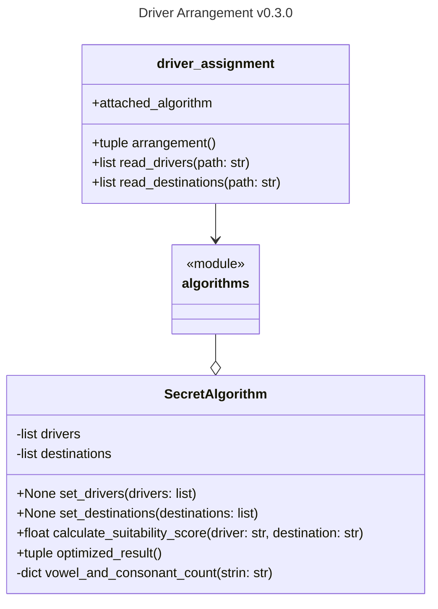
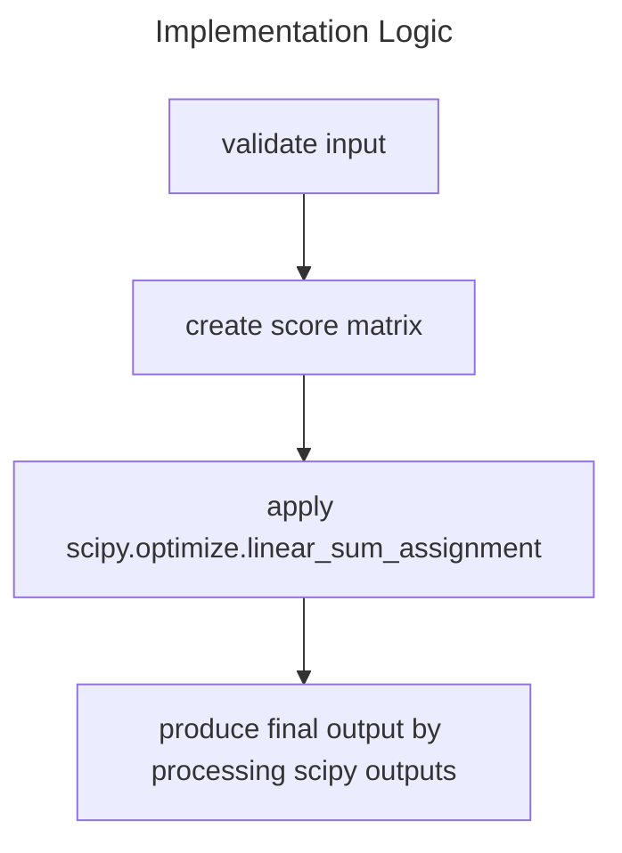

# Introduction
Before we introduce the architecture of the project, there is a concept used in this project other than the commonly known SOLID principle, which is [Knuth's optimization principle](https://wiki.c2.com/?PrematureOptimization): Premature optimization is the root of all evil. This concept can be applied to various aspects, not just in the code.

For example, the document structure. Because this is a small-scale project, many things are kept simple. We do not need to make the entire repository's structure complicated because we just don't have many files. We can rearrange it when we have more.

Next, we will introduce this project step by step. Because this is for an interview, the entire introduction will get into details, covering everything from the document structure to the program logic and even the code writing style.

## Project boilerplate
The file structure of this project is very simple. It consists of two main Python files, project configuration files, a test folder, and a mock data folder:
```
├── LICENSE
├── README.md
├── algorithms.py
├── driver_assignment.py
├── mock_data
│   ├── destinations_data
│   ├── destinations_data_massive
│   ├── destinations_data_unbalanced
│   ├── drivers_data
│   ├── drivers_data_massive
│   └── drivers_data_unbalanced
├── module_design.md
├── pyproject.toml
├── requirements.txt
└── tests
    ├── __init__.py
    └── test_algorithms.py
```

## Architecture
The entry point of the entire program is driver_assignment.py, which does high-level processing to meet the command-line operations mentioned in the challenge document, including argument parsing and file reading. One important thing is an algorithm implementation from algorithms.py will be attached to be the generator of the final result.

The algorithms.py is where we place our core algorithms. Currently, there is only one class ```SecretAlgorithm``` which generates a suitability score matrix of drivers and destinations and uses the [Hungarian Algorithm](https://en.wikipedia.org/wiki/Hungarian_algorithm) to find the assignment with the highest score.

I tried to reduce the coupling between the two files (modules) as much as possible. When there are different CLI operations, we can modify driver_assignment.py without affecting algorithms.py. New "secret algorithm" can also be implemented without affecting driver_assignment.py.

Below is the design diagram:

It's important to know that we do NOT consider driver_assignment.py as a module because it is transient, and it mainly serves as the entry point for the program. Suppose we intend to utilize the SecretAlgorithm class in a web-based project, driver_assignment.py could have been substituted with an alternative python file in that case.

## Implementation practices
Before discussing the logic of the code, some implementation patterns are worth discussing in advance. 
In a team, having common implementation standards can improve the quality of code, and I am always happy to comply with or participate in the formulation of these standards. 
In this project, there are no other developers, so the standards follow my personal preferences. Some are my habits, and some are standardards that we can easily follow by using a tool.

In a simple sentence, I follow the [PEP8](https://peps.python.org/pep-0008/#method-names-and-instance-variables) specification of Python official, and you will see the following in the code:
- snake case for names of variables, methods, and modules
- class names use the CapWords convention
- indentation and blank lines are consistent
- line wrapping is ignored by my own preference
To achieve this, I added autopep8 as the formatter to my IDE, and ignored E501 (line too long) error.

### [Return early pattern](https://dev.to/jpswade/return-early-12o5)
The first time I saw this pattern was when I was learning Golang in 2019. It is used by Gophers to handle errors. As a ```try/catch``` guy at that time, I was eye-opened by this concept. 
And I saw this concept was extended to be a solver of nested if/else problem, and it changed the way I design a function. I'm now a fan of getting rid of error-prone logic earlier, enabling more continuous thinking, and always staying on the [happy path](https://en.wikipedia.org/wiki/Happy_path).

The main concern with this pattern is that it increases the difficulty of logging and debugging. However, in my actual usage, I found that we can not only "early return" but also "early raise exception" and, of course, do logging before the code ends. 
I personally prefer using the "defer" statement in Golang to ensure logging is done correctly. And in Python, we can make [logging decorator](https://ankitbko.github.io/blog/2021/04/logging-in-python/) to achieve this. 

### Long naming
In this project, I rarely use common abbreviations for variable names, such as using "Algo" instead of "Algorithm". 
Instead, I try to write out the full words as much as possible. For engineers, these common abbreviations can effectively save code length and even accelerate the development process.

However, I believe that for a novice programmer or a PM without a computer science background, reading code full of abbreviations is more painful. Considering their needs, I tend to write out the full word without causing the code to become too verbose.
Moreover, with the help of an IDE, we do not need to type a lot more keyboard strokes to write out the full words. So why not help them a bit?

### Less-or-no comments
I admit that I'm lazy to write comments. But there is an idea that I agree with and am trying to adapt: [code tells you how, comments tell you why](https://blog.codinghorror.com/code-tells-you-how-comments-tell-you-why/). 
In my previous positions, I had a bad experience that the code and the comment isn't compatible. Comment itself can be a failure point if it lacks of maintenance! And maintainence is a cost of time and energy. So less comments, less possible faults.
It's not telling us not to write comments, but hoping that we write it when we must do it. With the previous principle I mentioned, the ultimate ideal situation is the code is already self-explained. It's hard to reach, but in this small project, I believe the readers are getting the idea without struggle. 

And don't mix up with documentation, what you're reading is a document (although not typical), not comments. This is helping you know more about this program, and it will also help any other person. 
In my opinion, documentation of systems, products, and even behavioral codes are very helpful. We don't need to bury ourselves with bunch of documents, but we probably need some of them to reference and onboard new developers.

### Extra empty line
Personally, I like to divide the code into chunks. After completing a small logic, I add a blank line. This allows me to put a checkpoint in my own thoughts and is helpful when debugging. In addition, because I use [neovim](https://neovim.io/) for editing, using ```shift + [ or ]``` helps me move quickly between blocks. If there are no blank lines, this feature cannot be used. 

## Implementation
TL;DR
- This is an [Assignment Problem](https://en.wikipedia.org/wiki/Assignment_problem), and we have the Hungarian Algorithm as the optimized solution.
- I initially implemented an imperfect solution, but gained experience and was able to strengthen my test cases from it.

### Program logic
As mentioned in the [README.md](./README.md), the core algorithm used in this implementation is the Hungarian Algorithm. 
When I first encountered this problem, I thought about algorithms I had learnt before and compared it to the knapsack problem. I treated each combination as a choice and used the mindset of solving a [0/1 knapsack](https://www.geeksforgeeks.org/0-1-knapsack-problem-dp-10/) problem to create the first implementation, selecting the combination with the maximum score in a greedy manner.

However, when I was writing tests, I revisited the problem and tried to apply my previous experience in transportation research. I realized that this is actually an assignment problem. I discovered the Hungarian Algorithm as the best solution, and further investigated its implementation. 
I found that the well-known library [Scipy](https://docs.scipy.org/doc/scipy/reference/generated/scipy.optimize.linear_sum_assignment.html) had already implemented it and had a strong performance in terms of execution speed.

So the second version was born, and the output logic of the entire program is:

After spending a few hours comparing the first implementation with the second implementation, I have gained some experience that I have not yet added here. I will add it later.

### Testing
I only did unit tests because, as mentioned earlier, I didn't consider driver_assignment as a module but more like an entry point to the program. Therefore, the main object to be tested in this project is the SecretAlgorithm class in algorithms.py.

After having the first version, I wrote tests to ensure that the basic functionality was working properly. 
I chose ```pytest``` as the testing package because its API is easier to use, and the testing code is shorter. 
Each test block has comments to explain the test items, and I set up Github Actions to perform tests every time I push to the main branch. 
If the test fails, I receive a notification via email. It is worth noting that the test for the optimized_result function includes an edge case that I ignored in the first version, which effectively verifies future modifications.

