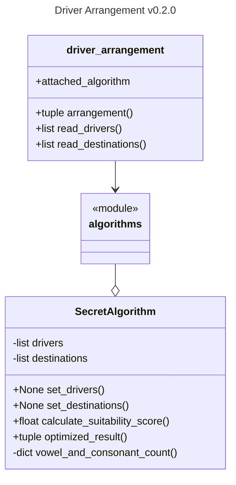

```mermaid
---
title: Driver Arrangement v0.2.0
---
classDiagram
    driver_arrangement --> algorithms
    algorithms --o SecretAlgorithm

    class driver_arrangement{
        +attached_algorithm

        +tuple arrangement()
        +list read_drivers()
        +list read_destinations()
    }
    class algorithms{
      <<module>>
    }
    class SecretAlgorithm{
        -list<string> drivers
        -list<string> destinations

        +None set_drivers()
        +None set_destinations()
        +float calculate_suitability_score()
        +tuple optimized_result()
        -dict vowel_and_consonant_count()
    }
```
