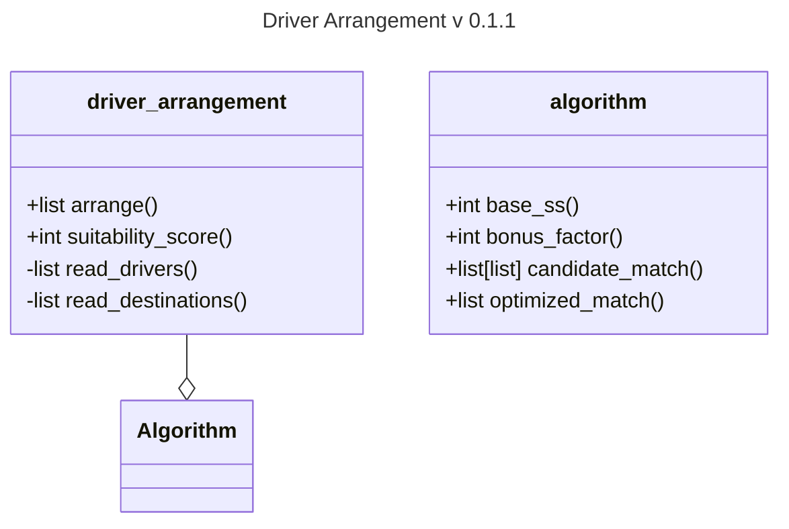

```mermaid
---
title: Driver Arrangement v 0.1.1
---
classDiagram
    driver_arrangement --o Algorithm

    class driver_arrangement{
        +list arrange()
        +int suitability_score()
        -list read_drivers()
        -list read_destinations()
    }
    class algorithm{
        +int base_ss()
        +int bonus_factor()
        +list[list] candidate_match()
        +list optimized_match()
    }
```
