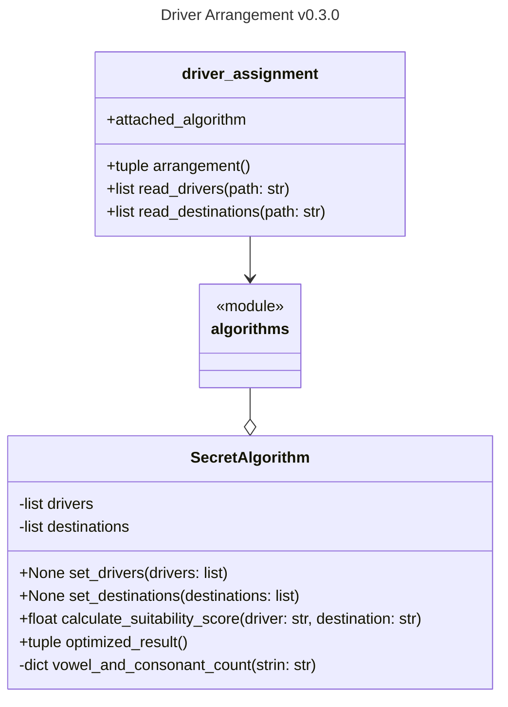
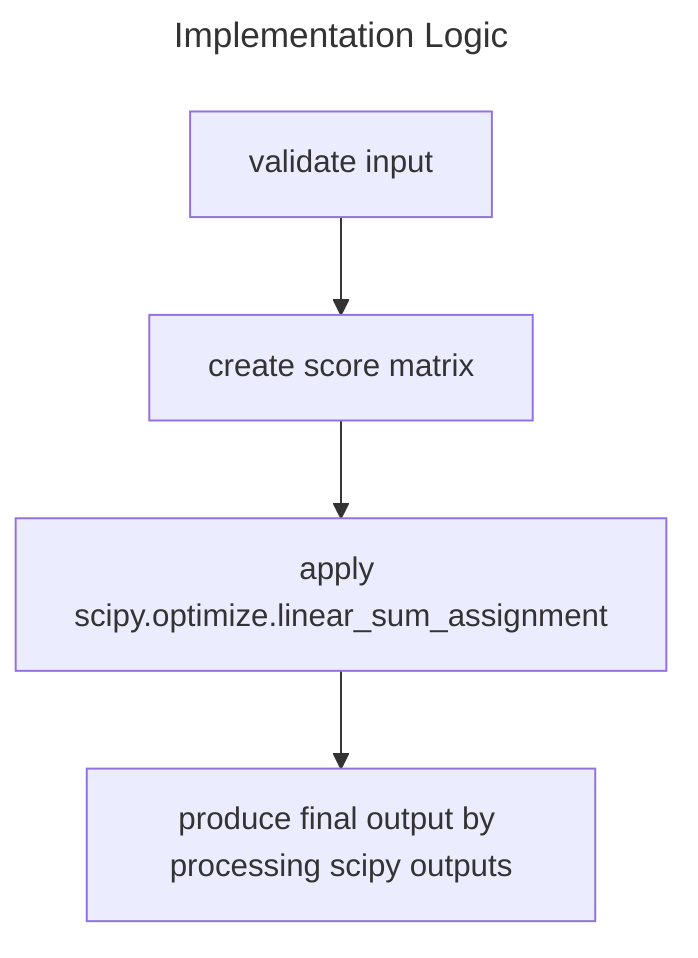

# Introduction
Before we introduce the architecture of the project, there is a concept used in this project other than the commonly known SOLID principle, which is [Knuth's optimization principle](https://wiki.c2.com/?PrematureOptimization): Premature optimization is the root of all evil. This concept can be applied to various aspects, not just in the code.

For example, the document structure. Because this is a small-scale project, many things are kept simple. We do not need to make the entire repository's structure complicated because we just don't have many files. We can rearrange it when we have more.

Next, we will introduce this project step by step. Since this is for an interview, the entire introduction will get into details, covering everything from the document structure to the program logic and even the code writing style.

## Project boilerplate
The file structure of this project is very simple. It consists of two main Python files, project configuration files, a test folder, and a mock data folder:
```
├── LICENSE
├── README.md
├── algorithms.py
├── driver_assignment.py
├── mock_data
│   ├── destinations_data
│   ├── destinations_data_massive
│   ├── destinations_data_unbalanced
│   ├── drivers_data
│   ├── drivers_data_massive
│   └── drivers_data_unbalanced
├── module_design.md
├── pyproject.toml
├── requirements.txt
└── tests
    ├── __init__.py
    └── test_algorithms.py
```

## Architecture
The entry point of the entire program is driver_assignment.py, which does high-level processing to meet the command-line operations mentioned in the challenge document, including argument parsing and file reading. One important thing is an algorithm implementation from algorithms.py will be attached to be the generator of the final result.

The algorithms.py is where we place our core algorithms. Currently, there is only one class ```SecretAlgorithm``` which generates a suitability score matrix of drivers and destinations and uses the [Hungarian Algorithm](https://en.wikipedia.org/wiki/Hungarian_algorithm) to find the assignment with the highest score.

I tried to reduce the coupling between the two files (modules) as much as possible. When there are different CLI operations, we can modify driver_assignment.py without affecting algorithms.py. New "secret algorithm" can also be implemented without affecting driver_assignment.py.

Below is the design diagram:

It's important to know that we do NOT consider driver_assignment.py as a module because it is transient, and it mainly serves as the entry point for the program. Suppose we intend to utilize the SecretAlgorithm class in a web-based project, driver_assignment.py could have been substituted with an alternative python file in that case.

## Implementation practices
Before discussing the logic of the code, some implementation patterns are worth discussing in advance. 
In a team, having common implementation standards can improve the quality of code, and I am always happy to comply with or participate in the formulation of these standards. 
In this project, there are no other developers, so the standards follow my personal preferences. Some are my habits, and some are standardards that we can easily follow by using a tool.

In a simple sentence, I follow the [PEP8](https://peps.python.org/pep-0008/#method-names-and-instance-variables) specification of Python official, and you will see the following in the code:
- snake case for names of variables, methods, and modules
- class names use the CapWords convention
- indentation and blank lines are consistent
- line wrapping is ignored by my own preference
To achieve this, I added autopep8 as the formatter to my IDE, and ignored E501 (line too long) error.

### [Return early pattern](https://dev.to/jpswade/return-early-12o5)
The first time I saw this pattern was when I was learning Golang in 2019. It is used by Gophers to handle errors. As a ```try/catch``` guy at that time, I was eye-opened by this concept. 
And I saw this concept was extended to be a solver of nested if/else problem, and it changed the way I design a function. I'm now a fan of getting rid of error-prone logic earlier, enabling more continuous thinking, and always staying on the [happy path](https://en.wikipedia.org/wiki/Happy_path).

The main concern with this pattern is that it increases the difficulty of logging and debugging. However, in my actual usage, I found that we can not only "early return" but also "early raise exception" and, of course, do logging before the code ends. 
I personally prefer using the "defer" statement in Golang to ensure logging is done correctly. And in Python, we can make [logging decorator](https://ankitbko.github.io/blog/2021/04/logging-in-python/) to achieve this. 

### Long naming
In this project, I rarely use common abbreviations for variable names, such as using "Algo" instead of "Algorithm". 
Instead, I try to write out the full words as much as possible. For engineers, these common abbreviations can effectively save code length and even accelerate the development process.

However, I believe that for a novice programmer or a PM without a computer science background, reading code full of abbreviations is more painful. Considering their needs, I tend to write out the full word without causing the code to become too verbose.
Moreover, with the help of an IDE, we do not need to type a lot more keyboard strokes to write out the full words. So why not help them a bit?

### Less-or-no comments
I admit that I'm lazy to write comments. But there is an idea that I agree with and am trying to adapt: [code tells you how, comments tell you why](https://blog.codinghorror.com/code-tells-you-how-comments-tell-you-why/). 
In my previous positions, I had a bad experience that the code and the comment isn't compatible. Comment itself can be a failure point if it lacks of maintenance! And maintainence is a cost of time and energy. So less comments, less possible faults.
It's not telling us not to write comments, but hoping that we write it when we must do it. With the previous principle I mentioned, the ultimate ideal situation is the code is already self-explained. It's hard to reach, but in this small project, I believe the readers are getting the idea without struggle. 

And don't mix up with documentation, what you're reading is a document (although not typical), not comments. This is helping you know more about this program, and it will also help any other person. 
In my opinion, documentation of systems, products, and even behavioral codes are very helpful. We don't need to bury ourselves with bunch of documents, but we probably need some of them to reference and onboard new developers.

### Extra empty line
Personally, I like to divide the code into chunks. After completing a small logic, I add a blank line. This allows me to put a checkpoint in my own thoughts and is helpful when debugging. In addition, because I use [neovim](https://neovim.io/) for editing, using ```shift + [ or ]``` helps me move quickly between blocks. If there are no blank lines, this feature cannot be used. 

## Implementation
TL;DR
- This is an [Assignment Problem](https://en.wikipedia.org/wiki/Assignment_problem), and we have the Hungarian Algorithm as the optimized solution.
- I initially implemented an imperfect solution, but gained experience and was able to strengthen my test cases from it.

### Program logic
As mentioned in the [README.md](./README.md), the core algorithm used in this implementation is the Hungarian Algorithm. 
When I first encountered this problem, I thought about algorithms I had learnt before and compared it to the knapsack problem. I treated each combination as a choice and used the mindset of solving a [0/1 knapsack](https://www.geeksforgeeks.org/0-1-knapsack-problem-dp-10/) problem to create the first implementation, selecting the combination with the maximum score in a greedy manner.

However, when I was writing tests, I revisited the problem and tried to apply my previous experience in transportation research. I realized that this is actually an assignment problem. I discovered the Hungarian Algorithm as the best solution, and further investigated its implementation. 
I found that the well-known library [Scipy](https://docs.scipy.org/doc/scipy/reference/generated/scipy.optimize.linear_sum_assignment.html) had already implemented it and had a strong performance in terms of execution speed.

So the second version was born, and the output logic of the entire program is:


### Testing
I only did unit tests because, as mentioned earlier, I didn't consider driver_assignment as a module but more like an entry point to the program. Therefore, the main object to be tested in this project is the SecretAlgorithm class in algorithms.py.

After having the first version, I wrote tests to ensure that the basic functionality was working properly. 
I chose ```pytest``` as the testing package because its API is easier to use, and the testing code is shorter. 
Each test block has comments to explain the test items, and I set up Github Actions to perform tests every time I push to the main branch. 
If the test fails, I receive a notification via email. It is worth noting that the test for the optimized_result function includes an edge case that I ignored in the first version, which effectively verifies future modifications.


## Research in different implementations
As mentioned earlier, I have two implementations for this project. The first one uses a greedy approach, while the second one uses the Hungarian algorithm. In this paragraph, I would like to compare these two implementations.

The first implementation is not perfect, as it uses an idea of 0/1 knapsack problem, and uses greedy method to select the combination with the maximum score. While it may work for some cases, it is not guaranteed to find the optimal solution. On the other hand, the second implementation that uses the Hungarian algorithm is known to provide the optimal solution for the assignment problem. 
Additionally, the implementation of the Hungarian algorithm in the ```Scipy``` library has a strong performance in terms of execution speed. [Discussion of Hungarian in Scipy](https://stackoverflow.com/questions/1398822/the-assignment-problem-a-numpy-function)

### The algorithms
As for the details of the Hungarian Algorithm, there are many resources available online, so I won't go into too much detail here. Let me just show the implementation of greedy method:
```python
def optimized_result(self) -> tuple:
    score_list = []
    for driver in self.__drivers:
        for destination in self.__destinations:
            score_list.append((self.calculate_suitability_score(
                driver=driver, destination=destination), driver, destination))

    score_list.sort(reverse=True)

    total_score = 0
    matching = []
    driver_assigned = set()
    destination_assigned = set()
    for candidate in score_list:
        score = candidate[0]
        driver = candidate[1]
        destination = candidate[2]

        if (driver in driver_assigned) or (destination in destination_assigned):
            continue

        total_score += score
        matching.append((driver, destination))
        driver_assigned.add(driver)
        destination_assigned.add(destination)

    return (total_score, matching)
```

In this implementation, I flattened the 2-D score matrix into a 1-D list, where each item represents a possible combination and the corresponding score.
Each item is a tuple that contains three elements ```(<suitability score>, <driver's name>, <destination>)```.

Next, I sorted the ```score_list``` in descending order by score. Python's built-in sort uses ```Tim sort```; and when the item is a tuple, it automatically uses the tuple's elements as keys. In this case, the suitability score will be the first key.

Then, I iterated through the entire ```score_list```. If the current driver or destination has already been assigned, I moved on to the next iteration. Otherwise, I selected the current item, updated the total score, and added the driver and destination to their respective sets indicating that they have been assigned.
This process will always choose the highest scored combination at the moment.

Finally, the program outputs the total score and the recorded matching list.

### Output scores
In the repository, there is a folder called ```mock_data``` that contains three sets of data: a small dataset, a massive dataset, and a unbalanced dataset - a dataset with a different number of drivers and destinations.

Running the small dataset, the scores obtained are:
```bash
running hungarian algorithm...
The score is 26.0
running greedy algorithm...
The score is 26.0
```
Running the massive dataset, the scores obtained are:
```bash
running hungarian algorithm...
The score is 11861.25
running greedy algorithm...
The score is 11668.25
```
Running the unbalanced dataset, the scores obtained are:
```bash
running hungarian algorithm...
The score is 12.0
running greedy algorithm...
The score is 12.0
```

### Score analysis
In order to analyze, I make an annotation as follows:
- Drivers are annotated as ```D1```, ```D2```, ```D3```...
- Destinations are ```A```, ```B```, ```C```...
- ```D1→A``` means driver 1 is assigned to destination ```A```
- ```S(D1→A)``` represents the suitability score of assigning driver 1 to ```A```.

We can see differences in the outputs generated by the two algorithms in the massive data set. After analysis, I found that this occurs when there is a pattern:
1. Both drivers have higher scores for sending to a certain location (we set it as ```A``` in the following analysis).
2. One driver has a smaller score difference between sending to each locations than the other (we set it as ```D1``` in the following analysis).
3. The driver with the smaller score difference has a higher score for sending to the higher-score location than the other driver.

With annotation:
```bash
S(D1→A) > S(D1→B) and
S(D2→A) > S(D2→B) and
S(D1→A) - S(D1→B) > S(D2→A) - S(D2→B) and
S(D1→A) > S(D2→A)
```

In this situation, in order to obtain a higher total score, it is actually better to send ```D1``` to ```B``` and ```D2``` to ```A```. However, due to the greedy algorithm, ```D1``` always takes the opportunity to send to ```A```, which results in a difference in the final score.

This finding is significant and I added a test case to verify it. It ensures that such issues can be detected during testing in the future.

### Complexity analysis
In my personal practice, after writing an algorithm, I usually calculate its complexity and compare it with the input and output scale of the system, to minimize the possibility of service level crashes caused by long computations.
The size of input isn't provided, so I have to make a guess. Base on the [Platform Science website](https://www.platformscience.com/blog/walmart-drives-innovation-with-platform-science), it's mentioned that we have a partnership with Walmart, who has over 12,000 drivers in their fleet. Considering that not all drivers may be working every day, I assumed a scale of 10^3 for both drivers and destinations would be appropriate. This is why I created the "massive" dataset with 1000 drivers and 1000 destinations. 

The time and space complexity of the Hungarian Algorithm have been proven in many places. When given an ```n * n``` matrix, the time complexity required is ```O(n ^ 3)``` and the space complexity is ```O(n ^ 2)```. If the matrix is not symmetric, the implementation I used from ```Scipy``` (which is also the implementation found in most places) fills in the matrix with dummy values to create a square matrix. For example, if there are ```n``` drivers and ```m``` destinations, where ```n > m```, the time and space complexity will still be ```O(n ^ 3)``` and ```O(n ^ 2)```, respectively.

Analyzing the algorithm I implemented, assuming there are n drivers and m destinations:

1. When generating the score list, both the time and space complexity are ```O(nm)```.
2. When sorting, the built-in sort function in Python uses ```Tim Sort```, which has an average and worst-case time complexity of ```O(nm log(nm))```.
3. In the subsequent iteration checks, the time complexity is ```O(nm)```. The use of a set in this part of the algorithm avoids consuming a large amount of time caused by the "```in```" syntax.

#### Conclusion of complexity analysis
Both implementations use ```O(nm)``` space.

When ```n = m``` and the number of elements is relatively small, the greedy algorithm's ```O(n^2 log(n^2))``` can be slightly faster than Hungarian's ```O(n^3)```, but as the input size increases, Hungarian becomes faster. (See [here](https://math.stackexchange.com/questions/319913/proof-that-n2-2n) for an indirect proof.)

When ```n ≠ m``` and the difference between the two is large, there is also a chance that the greedy algorithm will be faster.

I used Python's ```timeit``` library to verify the time complexity and used the data in the mock_data to test it. Each test was repeated five times and the average was taken for the final comparison.

#### Verification of time complexity
Result using the small dataset:
```bash
running hungarian algorithm...
The 5 running times are (in seconds):
[0.0001822170161176473, 8.365098619833589e-05, 6.718598888255656e-05, 6.456000846810639e-05, 6.234500324353576e-05]
The average is 9.199180058203638e-05

running greedy algorithm...
The 5 running times are (in seconds):
[7.441500201821327e-05, 6.137901800684631e-05, 5.488801980391145e-05, 5.203401087783277e-05, 4.9547990784049034e-05]
The average is 5.8452808298170565e-05
```

Result using the massive dataset:
```bash
running hungarian algorithm...
The 5 running times are (in seconds):
[1.932028994022403, 1.928344215004472, 2.038543648988707, 2.0489137950062286, 1.9490320490149315]
The average is 1.9793725404073483

running greedy algorithm...
The 5 running times are (in seconds):
[2.4045990869926754, 2.21334969898453, 2.24704545098939, 2.2789895000169054, 2.216378954995889]
The average is 2.2720725383958777
```

Result using the unbalanced dataset:
```bash
running hungarian algorithm...
The 5 running times are (in seconds):
[0.0021805599972140044, 0.001959411019925028, 0.001997704996028915, 0.002454861009027809, 0.0018952639948111027]
The average is 0.0020975602034013717

running greedy algorithm...
The 5 running times are (in seconds):
[0.001988987991353497, 0.0018725789850577712, 0.001900592993479222, 0.0019519649795256555, 0.001872861001174897]
The average is 0.0019173971901182084
```

The above analysis may seem less meaningful in pursuit of the best score, but it is still a great learning experience for me to share.
